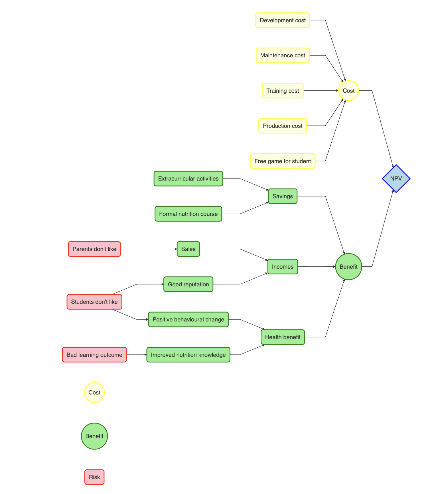

```{r setup, include=FALSE}
knitr::opts_chunk$set(echo = TRUE)
```

## Educational Mobile Game Vs. Educational Board Game

We analyze if the school should invest in mobile game or board game to improve nutrition knowledge of secondary students. Our aim is to identify the option with higher monetary value and learning effect- likelihood of wider knowledge dissemination and likelihood of behavioral change. 

The decision makers for this intervention are the school authorities, and the stakeholders are students, parents, and other players of mobile and board games. The impact pathway model for decision analysis is shown below. 




### Decision analysis in R

First we calculate the total cost for mobile game and board game. 


``` {r, eval= FALSE}
  

  # Calculate year one cost for mobile game
  
  cost_mobile_year_one <- c (cost_development_mobile + cost_launch_mobile,
                             rep(0, n_years -1))
                            

  
  # Calculate annual cost for mobile game
  
  cost_mobile_annual <- vv(cost_maintenace_mobile,
                           var_CV, n_years,
                           relative_trend = inflation_rate)
  
  # Calculate total cost for mobile game
  
  cost_mobile_total <- cost_mobile_year_one + cost_mobile_annual

  # Calculate year one cost for board game
  
  cost_board_year_one <- c (cost_development_board + cost_teacher_training +
                         (cost_batch_production_board * Board_school_reserve_unit),
                         rep(0, n_years -1))
                 
  
  # Calculate annual cost for board game
  
  # If game is hosted in designated room 
  
  designated_room_yes_no <- chance_event(if_separate_space,
                                         value_if = 1,
                                         value_if_not = 0)
  
  board_room_cost <- if (designated_room_yes_no == 1) {
    cost_space
  } else { 0 }
  
  # If game is hosted in afterschool hours
  
  afterschool_hours_yes_no <- chance_event(if_value_time,
                                           value_if = 1,
                                           value_if_not = 0)
  
  board_time_cost <- if (afterschool_hours_yes_no == 1) {
    cost_time
  } else { 0 }
  
  # Calculate annual cost of board game 
  
  cost_board_annual <- vv (board_room_cost + board_time_cost + 
                                  (cost_batch_production_board * (Board_sale_unit +
                                                                    Board_backup_unit)),
                                  var_CV, n_years,
                                  relative_trend = inflation_rate)
  
  # Calculate total cost for board game
  
  cost_board_total <- cost_board_year_one + cost_board_annual
  
```


Then we add potential risks for both intervention options.

``` {r, eval= FALSE }
  # Add risks that can reduce benefits
  
  # Parents' acceptance of mobile game and board based on game hour
  
  optimal_game_duration_yes_no <- chance_event(if_optimal_game_duration,
                                               value_if = 1,
                                               value_if_not = 0)
  
  parents_like_mobile <- if (optimal_game_duration_yes_no == 1) {
    if_parents_like_mobile
  } else { if_parents_like_mobile_time}
  
  parents_like_board <- if (optimal_game_duration_yes_no == 1) {
    if_parents_like_board
  } else { if_parents_like_board_time }
  
  mobile_user_risk <- min(if_stable_internet,
                          if_access_internet,
                          if_own_mobile_phone,
                          if_student_like_mobile,
                          parents_like_mobile,
                          if_learning_good_mobile)
  # only improved knowledge may be considered by parents before game subscription
                                                   
  # most likely they won't remember to connect dots with actual behavioral change in a short time
                                                 
  # how long do they think before making purchase? What are the important factors?
  
  board_sale_risk <- min(if_learning_good_board,
                         if_student_like_board,
                         parents_like_board) # same risk for board user 
  
  # risk for board game user and board game sale are separated because number of sale doesn't equal to number of user
  
  # multiple players can play a game set
  
  good_reputation_mobile_risk <- min (if_student_like_mobile,
                                      if_parents_like_mobile,
                                      if_learning_good_mobile,
                                      if_good_action_mobile)
  
  good_reputation_board_risk <- min (if_student_like_board,
                                     if_parents_like_board,
                                     if_learning_good_board,
                                     if_good_action_board)
  
  value_nutrition_risk_mobile <- min (if_learning_good_mobile,
                                      if_good_action_mobile)
  
  value_nutrition_risk_board <- min (if_learning_good_board,
                                     if_good_action_board)

```


We then calculate total benefits for mobile game intervention.

``` {r, eval= FALSE}
  # Calculate total benefits for mobile game
  
  # Calculate income from mobile game subscription
  
  income_mobile_subscription <- vv (Income_mobile_batch_sale * Mobile_user_unit,
                                    var_CV, n_years,
                                    relative_trend = inflation_rate)* mobile_user_risk
  
  # Calculate extra income from good reputation for mobile game intervention
  
  value_good_reputation_mobile <- vv (Value_good_reputation,
                                      var_CV, n_years,
                                      relative_trend = inflation_rate)* good_reputation_mobile_risk
  
  value_good_reputation_mobile[1] <- 0 # value starts at year 2
  
  # Calculate saving from not needing formal nutrition course for both mobile and board game intervention
  
  saving_nutrition_course <- vv (Saving_nutrition_course,
                                 var_CV, n_years,
                                 relative_trend = inflation_rate)
  
  # Calculate value of adopting good eating habits with mobile game intervention
  
  value_nutrition_mobile <- vv (Value_nutrition * (Mobile_user_unit * behavioural_change_mobile),
                                var_CV, n_years,
                                relative_trend = inflation_rate)* value_nutrition_risk_mobile
  
  # Sum all benefits for mobile game
  
  benefit_mobile_total <- income_mobile_subscription + value_good_reputation_mobile +
                          saving_nutrition_course + value_nutrition_mobile

```


Here we calculate total monetary benefits  for school for mobile game option by excluding 'value_nutrition_mobile.' value_nutrition_mobile is the estimate value of adopting good eating habits by the users after playing the game. The value will directly benefit the users and potentially health care system, but not the school. Thus, we calculate actual monetary benefit to offset the cost invested by the school. 

``` {r, eval = FALSE}
  # Sum all benefits for school
  
  benefit_school_mobile <- income_mobile_subscription + value_good_reputation_mobile +
                            saving_nutrition_course
```


We then calculate total benefits for board game option and total monetary benefit for school if invested in board game. 

``` {r, eval = FALSE}
  # Calculate total benefits for board game intervention
  
  # Calculate total savings for board game intervention
  
  saving_board_total <- vv (Saving_board_game + saving_nutrition_course,
                            var_CV, n_years,
                            relative_trend = inflation_rate)
  
  # Calculate income from board game sale
  
  income_board_sale <- vv (Income_board_batch_sale * Board_sale_unit,
                           var_CV, n_years,
                           relative_trend = inflation_rate)* board_sale_risk
  
  # Calculate extra income from good school reputation with board game intervention
  
  value_good_reputation_board <- vv (Value_good_reputation,
                                     var_CV, n_years,
                                     relative_trend = inflation_rate)* good_reputation_board_risk
  
  value_good_reputation_board[1] <- 0 # value starts at year 2
  
  # Calculate value of adopting good eating habits with board game intervention
  # Divided by 1000 to get per 1000 value
  value_nutrition_board <- vv (Value_nutrition * ((Board_user * behavioural_change_board)/1000),
                               var_CV, n_years,
                               relative_trend = inflation_rate)* value_nutrition_risk_board
  
  # Sum all benefits for board game intervention
  
  benefit_board_total <- saving_board_total + income_board_sale + 
                         value_good_reputation_board + value_nutrition_board
  
  # Sum all benefits for school
  
  benefit_school_board <- saving_board_total + income_board_sale + 
    value_good_reputation_board
  
```


We calculate NPV of projects for both options. NPV for school is the net profit gained by school for each intervention. 

``` {r, eval = FALSE}
  
  # Calculate net profit for mobile game intervention
  
  mobile_intervention_result <- benefit_mobile_total - cost_mobile_total
  
  # NPV for school
  
  mobile_school_result <- benefit_school_mobile - cost_mobile_total
  
  # Calculate net profit for board game intervention
  
  board_intervention_result <- benefit_board_total - cost_board_total
  
  # NPV for school
  
  board_school_result <- benefit_school_board - cost_board_total
  
  # Calculate NPV with discount rate
  
  NPV_mobile <- discount (x = mobile_intervention_result,
                          discount_rate = discount_rate,
                          calculate_NPV = TRUE)
  
  NPV_board <- discount (x = board_intervention_result,
                         discount_rate = discount_rate,
                         calculate_NPV = TRUE)
  
  # NPV for school
  
  NPV_mobile_school <- discount (x = mobile_school_result,
                          discount_rate = discount_rate,
                          calculate_NPV = TRUE)
  
  NPV_board_school <- discount (x = board_school_result,
                         discount_rate = discount_rate,
                         calculate_NPV = TRUE)

```


We run the MC simulation for 1000 times. 

``` {r, eval = FALSE}
# Run the Monte Carlo Simulation

Game_mc_simulation <- mcSimulation(estimate = estimate_read_csv("Game.csv"),
                                   model_function = Game_function,
                                   numberOfModelRuns = 1000,
                                   functionSyntax = "plainNames")

```


``` {r, echo = FALSE}

library(decisionSupport)

# Make variables

make_variables<-function(est,n=1)
  
{ x<-random(rho=est, n=n)
for(i in colnames(x)) assign(i, as.numeric(x[1,i]),envir=.GlobalEnv)}

make_variables(estimate_read_csv(paste("Game.csv")))

Game_function <- function(x, varnames) {
  
  # Calculate year one cost for mobile game
  
  cost_mobile_year_one <- c (cost_development_mobile + cost_launch_mobile,
                             rep(0, n_years -1))
                            

  
  # Calculate annual cost for mobile game
  
  cost_mobile_annual <- vv(cost_maintenace_mobile,
                           var_CV, n_years,
                           relative_trend = inflation_rate)
  
  # Calculate total cost for mobile game
  
  cost_mobile_total <- cost_mobile_year_one + cost_mobile_annual
  
  # Calculate year one cost for board game
  
  cost_board_year_one <- c (cost_development_board + cost_teacher_training +
                         (cost_batch_production_board * Board_school_reserve_unit),
                         rep(0, n_years -1))
                 
  
  # Calculate annual cost for board game
  
  # If game is hosted in designated room 
  
  designated_room_yes_no <- chance_event(if_separate_space,
                                         value_if = 1,
                                         value_if_not = 0)
  
  board_room_cost <- if (designated_room_yes_no == 1) {
    cost_space
  } else { 0 }
  
  # If game is hosted in afterschool hours
  
  afterschool_hours_yes_no <- chance_event(if_value_time,
                                           value_if = 1,
                                           value_if_not = 0)
  
  board_time_cost <- if (afterschool_hours_yes_no == 1) {
    cost_time
  } else { 0 }
  
  # Calculate annual cost of board game 
  
  cost_board_annual <- vv (board_room_cost + board_time_cost + 
                                  (cost_batch_production_board * (Board_sale_unit +
                                                                    Board_backup_unit)),
                                  var_CV, n_years,
                                  relative_trend = inflation_rate)
  
  # Calculate total cost for board game
  
  cost_board_total <- cost_board_year_one + cost_board_annual
  
  # Add risks that can reduce benefits
  
  # Parents' acceptance of mobile game and board based on game hour
  
  optimal_game_duration_yes_no <- chance_event(if_optimal_game_duration,
                                               value_if = 1,
                                               value_if_not = 0)
  
  parents_like_mobile <- if (optimal_game_duration_yes_no == 1) {
    if_parents_like_mobile
  } else { if_parents_like_mobile_time}
  
  parents_like_board <- if (optimal_game_duration_yes_no == 1) {
    if_parents_like_board
  } else { if_parents_like_board_time }
  
  mobile_user_risk <- min(if_stable_internet,
                          if_access_internet,
                          if_own_mobile_phone,
                          if_student_like_mobile,
                          parents_like_mobile,
                          if_learning_good_mobile) # only improved knowledge may be considered by parents before game subscription
                                                   # most likely they won't remember to connect dots with actual behavioral change in a short time
                                                   # how long do they think before making purchase? What are the important factors?
  
  board_sale_risk <- min(if_learning_good_board,
                         if_student_like_board,
                         parents_like_board) # same risk for board user 
  # risk for board game user and board game sale are separated because number of sale doesn't equal to number of user
  # multiple players can play a game set
  
  good_reputation_mobile_risk <- min (if_student_like_mobile,
                                      if_parents_like_mobile,
                                      if_learning_good_mobile,
                                      if_good_action_mobile)
  
  good_reputation_board_risk <- min (if_student_like_board,
                                     if_parents_like_board,
                                     if_learning_good_board,
                                     if_good_action_board)
  
  value_nutrition_risk_mobile <- min (if_learning_good_mobile,
                                      if_good_action_mobile)
  
  value_nutrition_risk_board <- min (if_learning_good_board,
                                     if_good_action_board)
  
  # Calculate total benefits for mobile game
  
  # Calculate income from mobile game subscription
  
  income_mobile_subscription <- vv (Income_mobile_batch_sale * Mobile_user_unit,
                                    var_CV, n_years,
                                    relative_trend = inflation_rate)* mobile_user_risk
  
  # Calculate extra income from good reputation for mobile game intervention
  
  value_good_reputation_mobile <- vv (Value_good_reputation,
                                      var_CV, n_years,
                                      relative_trend = inflation_rate)* good_reputation_mobile_risk
  
  value_good_reputation_mobile[1] <- 0 # value starts at year 2
  
  # Calculate saving from not needing formal nutrition course for both mobile and board game intervention
  
  saving_nutrition_course <- vv (Saving_nutrition_course,
                                 var_CV, n_years,
                                 relative_trend = inflation_rate)
  
  # Calculate value of adopting good eating habits with mobile game intervention
  
  value_nutrition_mobile <- vv (Value_nutrition * (Mobile_user_unit * behavioural_change_mobile),
                                var_CV, n_years,
                                relative_trend = inflation_rate)* value_nutrition_risk_mobile
  
  # Sum all benefits for mobile game
  
  benefit_mobile_total <- income_mobile_subscription + value_good_reputation_mobile +
                          saving_nutrition_course + value_nutrition_mobile
  
  # Sum all benefits for school
  
  benefit_school_mobile <- income_mobile_subscription + value_good_reputation_mobile +
                            saving_nutrition_course
  
  # Calculate total benefits for board game intervention
  
  # Calculate total savings for board game intervention
  
  saving_board_total <- vv (Saving_board_game + saving_nutrition_course,
                            var_CV, n_years,
                            relative_trend = inflation_rate)
  
  # Calculate income from board game sale
  
  income_board_sale <- vv (Income_board_batch_sale * Board_sale_unit,
                           var_CV, n_years,
                           relative_trend = inflation_rate)* board_sale_risk
  
  # Calculate extra income from good school reputation with board game intervention
  
  value_good_reputation_board <- vv (Value_good_reputation,
                                     var_CV, n_years,
                                     relative_trend = inflation_rate)* good_reputation_board_risk
  
  value_good_reputation_board[1] <- 0 # value starts at year 2
  
  # Calculate value of adopting good eating habits with board game intervention
  # Divided by 1000 to get per 1000 value
  value_nutrition_board <- vv (Value_nutrition * ((Board_user * behavioural_change_board)/1000),
                               var_CV, n_years,
                               relative_trend = inflation_rate)* value_nutrition_risk_board
  
  # Sum all benefits for board game intervention
  
  benefit_board_total <- saving_board_total + income_board_sale + 
                         value_good_reputation_board + value_nutrition_board
  
  # Sum all benefits for school
  
  benefit_school_board <- saving_board_total + income_board_sale + 
    value_good_reputation_board
  
  # Calculate net profit for mobile game intervention
  
  mobile_intervention_result <- benefit_mobile_total - cost_mobile_total
  
  # NPV for school
  
  mobile_school_result <- benefit_school_mobile - cost_mobile_total
  
  # Calculate net profit for board game intervention
  
  board_intervention_result <- benefit_board_total - cost_board_total
  
  # NPV for school
  
  board_school_result <- benefit_school_board - cost_board_total
  
  # Calculate NPV with discount rate
  
  NPV_mobile <- discount (x = mobile_intervention_result,
                          discount_rate = discount_rate,
                          calculate_NPV = TRUE)
  
  NPV_board <- discount (x = board_intervention_result,
                         discount_rate = discount_rate,
                         calculate_NPV = TRUE)
  
  # NPV for school
  
  NPV_mobile_school <- discount (x = mobile_school_result,
                          discount_rate = discount_rate,
                          calculate_NPV = TRUE)
  
  NPV_board_school <- discount (x = board_school_result,
                         discount_rate = discount_rate,
                         calculate_NPV = TRUE)
  
  return(list(NPV_mobile_game = NPV_mobile,
              NPV_board_game = NPV_board,
              NPV_mobile_school = NPV_mobile_school,
              NPV_board_school = NPV_board_school,
              Cashflow_mobile_school = mobile_school_result,
              Cashflow_board_school = board_school_result,
              total_costs_mobile = sum(cost_mobile_total),
              total_costs_board = sum(cost_board_total),
              Cashflow_mobile_game = mobile_intervention_result,
              Cashflow_board_game = board_intervention_result))
  
}

input_game <- read.csv("Game.csv")

# Run the Monte Carlo Simulation

Game_mc_simulation <- mcSimulation(estimate = estimate_read_csv("Game.csv"),
                                   model_function = Game_function,
                                   numberOfModelRuns = 1000,
                                   functionSyntax = "plainNames")
```


### Simulation results for project

We generate plots of simulation result for the project which includes the value of nutrition. As seen in the histogram, the range of net present value (NPV) for mobile game intervention is significantly higher (approx 150-900 million mmk) than the NPV for board game intervention (approx. 10-130 million mmk). This is due to significantly higher expected mobile game subscribers. 


```{r}
plot_distributions(mcSimulation_object = Game_mc_simulation,
                   vars = c("NPV_mobile_game", "NPV_board_game"),
                   method = 'hist_simple_overlay',
                   x_axis_name = 'million Myanmar kyat',
                   base_size = 7)
```


Here is the result shown in boxplot. 

```{r}
plot_distributions(mcSimulation_object = Game_mc_simulation,
                   vars = c("NPV_mobile_game", "NPV_board_game"),
                   x_axis_name = 'million Myanmar kyat',
                   method = 'boxplot')
```


The predicted cash flow for simulation period of 3 years also confirm mobile game as the better intervention option. 

```{r}
plot_cashflow(mcSimulation_object = Game_mc_simulation,
              cashflow_var_name = c("Cashflow_board_game", "Cashflow_mobile_game"),
              x_axis_name = "Year",
              y_axis_name = "Cashflow in million Myanmar Kyat") 
```


### Simulation results for school

We generate the NPV result for school. This informs the school authority of the net profit they can expect from their investment. The school can expect higher NPV for mobile game but there is also a chance of overlap between net profit for mobile game and board game. 

```{r}

plot_distributions(mcSimulation_object = Game_mc_simulation,
                   vars = c("NPV_mobile_school", "NPV_board_school"),
                   method = 'hist_simple_overlay',
                   x_axis_name = 'million Myanmar kyat',
                   base_size = 7)
```


Here is the result shown in boxplot. The NPV for mobile game intervention still exceeds the NPV for board game intervention, but the difference between them is less pronounced if we consider only the actual monetary benefit for school- exclude the potential healthcare cost saved by individuals and healthcare system. 

```{r}

plot_distributions(mcSimulation_object = Game_mc_simulation,
                   vars = c("NPV_mobile_school", "NPV_board_school"),
                   x_axis_name = 'million Myanmar kyat',
                   method = 'boxplot')
```


Here is the projected cash flow for years of simulation. The mobile game intervention is expected to bring in higher positive cash flow in the long run, despite potential negative cash flow for about 6-19 months. 

```{r}
plot_cashflow(mcSimulation_object = Game_mc_simulation,
              cashflow_var_name = c("Cashflow_board_school", "Cashflow_mobile_school"),
              x_axis_name = 'Year',
              y_axis_name = 'Cashflow in million Myanmar Kyat')
```


Next, we do some post-hoc analyses for our model- the EVPI and PLS analyses. 

#### EVPI

For EVPI (expected value of perfect information) analysis, there is no variable with positive EVPI except for the net present value (NPV) of mobile game intervention for school. There is high uncertainty around the variable 'if_stable_internet' (the probability of having access to stable internet connection) for the mobile game intervention for school (wider range of input estimates). However, the EVPI plot shows 'zero' for the expected value of perfect information for the variable "if_stable_internet." An EVPI value of 'zero' means more information on that variable will not change the decision. 

*(I think EVPI plot would only be generated with positive value- zero EVPI is not positive. So, there maybe something wrong with the model.)*

```{r}
mcSimulation_table <- data.frame(Game_mc_simulation$x, 
                                 Game_mc_simulation$y[1:4])

evpi_mobile <- multi_EVPI(mc = mcSimulation_table, first_out_var = "NPV_mobile_game")
evpi_board <- multi_EVPI(mc = mcSimulation_table, first_out_var = "NPV_board_game")
evpi_mobile_school <- multi_EVPI(mc = mcSimulation_table, first_out_var = "NPV_mobile_school")
evpi_board_school <- multi_EVPI(mc = mcSimulation_table, first_out_var = "NPV_board_school")


plot_evpi(evpi_mobile, decision_vars = "NPV_mobile_game")
plot_evpi(evpi_board, decision_vars = "NPV_board_game")
plot_evpi(evpi_mobile_school, decision_vars = "NPV_mobile_school")
plot_evpi(evpi_board_school, decision_vars = "NPV_board_school")
```

#### PLS

We also identify variable of importance in projection and their direction of impact (positive or negative) on the outcomes using PLS analysis.

```{r, fig.cap= "NPV of mobile game intervention for project"}

pls_result <- plsr.mcSimulation(object = Game_mc_simulation,
                                resultName = names
                                (Game_mc_simulation$y)[1], # NPV_mobile_game
                                ncomp = 1)

plot_pls(pls_result, input_table = input_game, threshold = 0.9)
```

```{r, fig.cap= "NPV of board game intervention for project"}
pls_result <- plsr.mcSimulation(object = Game_mc_simulation,
                                resultName = names
                                (Game_mc_simulation$y)[2], # NPV_board_game
                                ncomp = 1)
plot_pls(pls_result, input_table = input_game, threshold = 0.9)
```

```{r, fig.cap= "NPV of mobile game intervention for school"}

pls_result <- plsr.mcSimulation(object = Game_mc_simulation,
                                resultName = names
                                (Game_mc_simulation$y)[3], # NPV_mobile_school
                                ncomp = 1)
plot_pls(pls_result, input_table = input_game, threshold = 0.9)
```


```{r, fig.cap="NPV of board game intervention for school"}
pls_result <- plsr.mcSimulation(object = Game_mc_simulation,
                                resultName = names
                                (Game_mc_simulation$y)[4], 
                                ncomp = 1)
plot_pls(pls_result, input_table = input_game, threshold = 0.9) # NPV_board_school
```


#### Cost
Here we calculate total cost for each intervention option.

```{r}
summary(Game_mc_simulation$y$total_costs_mobile)
summary(Game_mc_simulation$y$total_costs_board)
```

#### Summary 

Here is the summary of the results of our models. 

```{r}
library(gtExtras)
library(svglite)
mcSimulation_summary <- data.frame(Game_mc_simulation$x[2:41], 
                                   Game_mc_simulation$y[1:3])

gt_plt_summary(mcSimulation_summary) 
```

### Conclusion

The MC simulation results show the mobile game intervention has far-reaching impact and higher long-term profit than the board game intervention. However, substantially higher investment is needed for mobile game intervention than for board game intervention. The potential negative cash flow for initial months for mobile game option means the school needs to hold out for at least around 6 months before cash flow becomes positive. The NPV for mobile game intervention is also positive, and thus, it isn't a bad choice either. 

In conclusion, both interventions can bring in profit but the mobile game intervention is significant superior in terms of long-term profit and far-reaching nutrition benefits. However, the school should decide which intervention to invest in, based on their available capital. 